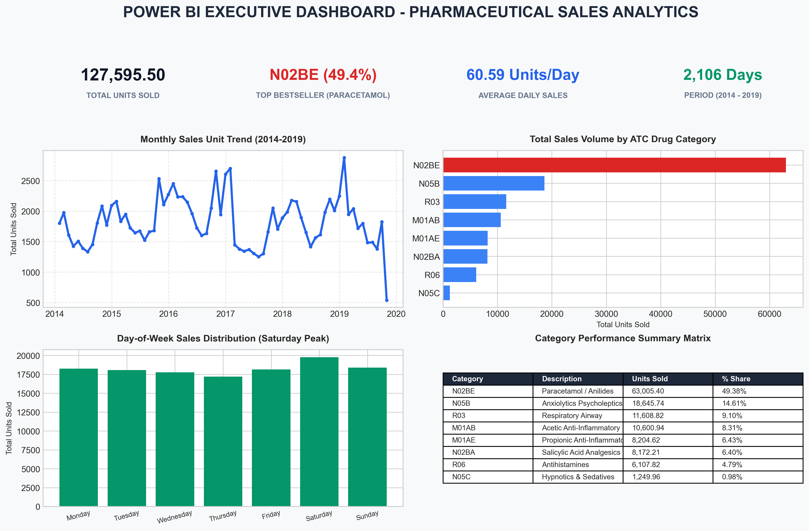
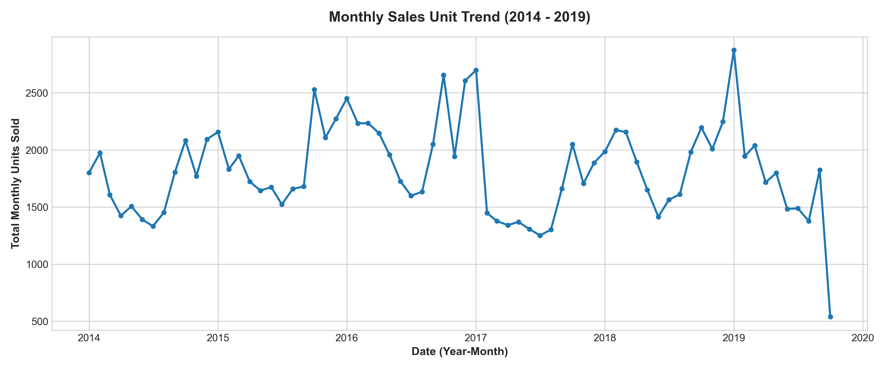
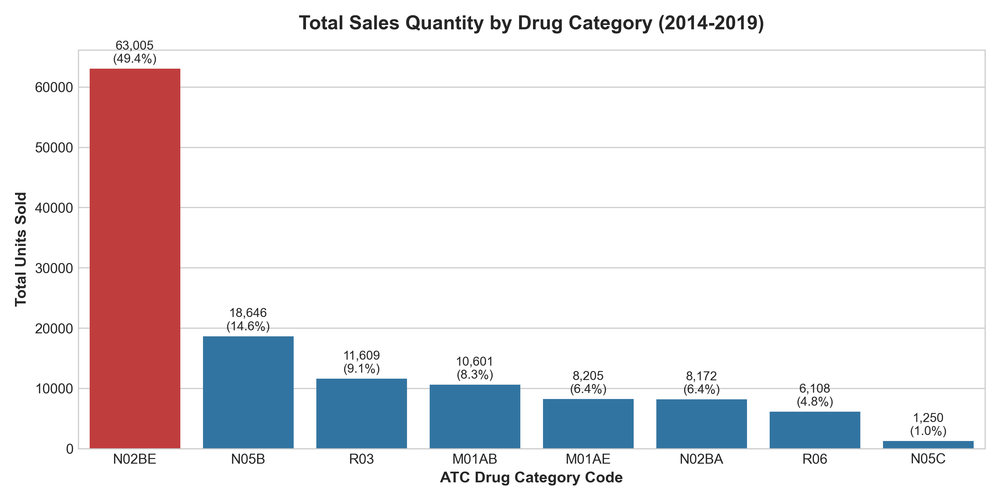
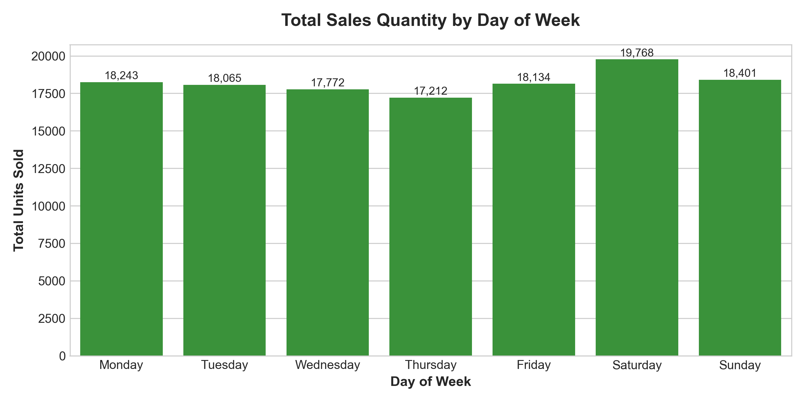

# Pharmaceutical Sales Analytics

A comprehensive data analytics project examining 5.5 years of daily pharmaceutical sales data (2,106 calendar days, 127,595.50 units sold) across 8 Anatomical Therapeutic Chemical (ATC) drug categories. This repository demonstrates end-to-end data analysis workflows encompassing **Excel data cleaning**, **SQL relational modeling & querying**, **Python exploratory data analysis (EDA)**, and a **Power BI analytics dashboard blueprint**.

---

## Power BI Dashboard Overview



The Power BI dashboard design blueprint features an interactive canvas built on a Star Schema data model:
- **KPI Row**: Displays Total Sales Volume (`127,595.50` units), Top Bestseller (`N02BE` - 49.38% share of total sales volume), Average Daily Sales (`60.59` units/day), and Total Days Analyzed (`2,106` days).
- **Monthly Sales Unit Trend**: Line chart visualizing 5.5 years of monthly sales, highlighting winter disease surges with explicit partial month annotation for October 2019 (data available through Oct 8).
- **Category Volume Column Chart**: Compares overall unit volume across 8 ATC drug categories.
- **Weekday Sales Distribution**: Horizontal bar chart tracking demand from Monday through Sunday (Saturday peak volume).
- **Performance Matrix Table**: Drilldown matrix by Drug Category, Year, and Volume Share.

---

## Technical Authenticity & Architecture

To maintain complete technical transparency and defensibility:
- **Python Exploratory Data Analysis & Visualization**: Executed via [`python/pharma_data_analysis.py`](python/pharma_data_analysis.py), which processes raw daily records, unpivots category metrics, and renders high-resolution analytical dashboard visualizations (`screenshots/dashboard_overview_python.png`).
- **SQL Relational Database Modeling**: Database schema (`sql/01_schema_and_import.sql`), transformation unpivoting (`sql/02_data_cleaning.sql`), and analytical queries (`sql/03_analytical_queries.sql`) were authored and validated using standard ANSI SQL with **PostgreSQL** syntax (incorporating window functions `LAG()`, `RANK()`, `ROW_NUMBER()`, and `EXTRACT()`), with **SQLite** compatibility notes included.
- **Power BI Data Model & DAX Specifications**: Provided in [`powerbi/dax_measures.dax`](powerbi/dax_measures.dax), [`powerbi/data_model_schema.md`](powerbi/data_model_schema.md), and [`powerbi/dashboard_layout_guide.md`](powerbi/dashboard_layout_guide.md) as a complete design blueprint for Power BI Desktop deployment.

---

## Business Objectives

1. **Category Demand Analysis**: Quantify total unit sales and volume share across 8 distinct ATC drug categories to identify top revenue drivers.
2. **Seasonality & Trend Identification**: Analyze monthly and annual sales patterns to pinpoint peak consumption periods (e.g., flu season vs. summer months).
3. **Purchasing Behavior Mapping**: Evaluate day-of-week demand trends to optimize pharmacy staffing and delivery schedules.
4. **Cross-Tool Data Reconciliation**: Establish single-source-of-truth data governance ensuring calculation parity across Excel, SQL, Python, and Power BI metrics.

---

## Dataset Description

The dataset comprises daily sales transactions recorded across 6 consecutive years (2014–2019) for 8 standardized Anatomical Therapeutic Chemical (ATC) drug classification codes.

| Field Name | Data Type | Description |
| :--- | :--- | :--- |
| `datum` | Date | Transaction date (`YYYY-MM-DD` / `MM/DD/YYYY`) |
| `M01AB` | Float | Anti-inflammatory & antirheumatic products, non-steroids (Acetic acid derivatives) |
| `M01AE` | Float | Anti-inflammatory & antirheumatic products, non-steroids (Propionic acid derivatives) |
| `N02BA` | Float | Other analgesics and antipyretics (Salicylic acid and derivatives - Aspirin) |
| `N02BE` | Float | Other analgesics and antipyretics (Anilides - Paracetamol / Acetaminophen) |
| `N05B` | Float | Psycholeptics (Anxiolytics - Anti-anxiety medications) |
| `N05C` | Float | Psycholeptics (Hypnotics and sedatives - Sleep aids) |
| `R03` | Float | Drugs for obstructive airway diseases (Asthma / COPD inhalers & medications) |
| `R06` | Float | Antihistamines for systemic use (Allergy relief) |
| `Year` | Integer | Transaction year (`2014` - `2019`) |
| `Month` | Integer | Transaction month (`1` - `12`) |
| `Hour` | Integer | Aggregated transaction hour |
| `Weekday Name` | String | Day of week (`Monday` through `Sunday`) |

### Key Dataset Statistics
- **Total Days Analyzed**: `2,106` days (January 2, 2014 to October 8, 2019)
- **Total Sales Volume**: `127,595.50` units
- **Average Daily Volume**: `60.59` units/day
- **Missing Values / Nulls**: `0` null values across all drug columns

---

## Data Reconciliation & Quality

A **0.79% variance (1,009.73 units)** was identified between the daily granular dataset (`127,595.50` units across 2,106 days) and the pre-aggregated monthly summary dataset (`126,585.77` units). Investigation traced the difference to partial-month truncation in October 2019, where daily records were available only through **8 October 2019** (`1,009.73` units logged over 8 days). The daily granular dataset was therefore established as the single analytical source of truth across all tools.

---

## Analytical Dashboard Visualizations & Decision Captions

### Figure 1: Analytical Dashboard Overview

- **Insight**: Multi-panel analytical dashboard synthesizing category sales volume, monthly trends, weekday demand distribution, and annual totals.
- **Decision Supported**: **Provides executive decision-makers with a single consolidated view to balance short-term staffing with long-term inventory buffer planning.**

### Figure 2: Monthly Sales Unit Trend

- **Insight**: Sales surge significantly during winter months (Jan: 13,971 units, Oct: 12,051 units) with an annotated partial-month drop in October 2019 (data available through Oct 8 only).
- **Decision Supported**: **Winter demand surge → Supports seasonal safety-stock buffering starting in September to prevent cold/flu medication stockouts.**

### Figure 3: Category Sales Volume Share

- **Insight**: `N02BE` (Paracetamol / Anilides) accounts for 49.38% share of total sales volume (63,005.40 units), followed by `N05B` (14.61%) and `R03` (9.10%).
- **Decision Supported**: **High N02BE volume concentration → Supports priority inventory procurement and warehouse stocking for high-demand analgesics.**

### Figure 4: Day-of-Week Sales Distribution

- **Insight**: Saturday records the highest weekly sales volume (19,768 units, 15.49% weekly share), while Thursday records the lowest (17,212 units).
- **Decision Supported**: **Saturday peak → Supports optimizing weekend pharmacy staffing and retail fulfillment schedules.**

---

## Tools & Technology Stack

- **Data Cleaning & Validation**: Excel (`SUMIFS`, `AVERAGEIFS`, `COUNTIF`, `XLOOKUP`, Pivot Tables)
- **Database & Querying**: SQL / PostgreSQL (`DDL`, `DML`, Unpivoting `UNION ALL`, `GROUP BY`, Window Functions `LAG()`, `RANK()`, `ROW_NUMBER()`)
- **Data Processing & Scripting**: Python 3.10, `pandas`, `numpy`
- **Exploratory Data Analysis & Visualization**: `matplotlib`, `seaborn`
- **Business Intelligence**: Power BI Blueprint Specifications (`powerbi/dax_measures.dax`, `powerbi/data_model_schema.md`), DAX Time Intelligence (`TOTALYTD`, `SAMEPERIODLASTYEAR`, `DIVIDE`, Star Schema Modeling)

---

## Project Architecture & Directory Structure

```text
pharma-sales-analytics/
│
├── data/
│   ├── salesdaily.csv              # Granular daily sales source of truth (2,106 rows)
│   ├── saleshourly.csv             # Hourly transaction records (50,534 rows)
│   ├── salesmonthly.csv            # Monthly aggregated summary (70 rows)
│   └── salesweekly.csv             # Weekly aggregated summary (304 rows)
│
├── excel/
│   ├── pharma_sales_excel_cleaning.md       # Step-by-step Excel cleaning documentation
│   └── data_cleaning_validation_summary.csv # Excel pivot validation summary dataset
│
├── sql/
│   ├── 01_schema_and_import.sql    # DDL scripts for staging, dim, and fact tables
│   ├── 02_data_cleaning.sql        # Data transformation & unpivoting queries
│   └── 03_analytical_queries.sql   # SQL business analytical queries & window functions
│
├── python/
│   ├── pharma_data_analysis.py     # Python data analysis & chart generator
│   └── data_verification.py        # Automated cross-tool reconciliation script
│
├── powerbi/
│   ├── dax_measures.dax            # Complete DAX measures library
│   ├── data_model_schema.md        # Star schema relationships & modeling guide
│   └── dashboard_layout_guide.md   # Visual layout & canvas specifications
│
├── screenshots/
│   ├── powerbi_dashboard_overview.png # Main Power BI Dashboard visualization
│   ├── powerbi_sales_analysis.png     # Power BI Time/Category sales visualization
│   ├── powerbi_detailed_analysis.png  # Detailed visual dashboard breakdown
│   ├── chart_category_sales.png       # Python category sales volume chart
│   ├── chart_monthly_trend.png        # Python monthly sales trend chart
│   └── chart_weekday_sales.png        # Python weekday sales distribution chart
│
├── README.md                       # Main project documentation
└── .gitignore                      # Git ignore file
```

---

## Key Analytical Insights & Decision Summary

1. **Bestseller Volume Share**: `N02BE` (Paracetamol / Anilides) generated **63,005.40 units** (**49.38% share of total sales volume**). *Decision: Prioritize supplier contracts and bulk warehouse allocation for N02BE.*
2. **Slow-Moving Category**: `N05C` (Hypnotics & Sedatives) generated **1,249.96 units** (**0.98% share of total sales volume**). *Decision: Transition N05C to on-demand procurement to reduce holding costs.*
3. **Winter Seasonality Surge**: Demand spikes in January (13,971 units) and October (12,051 units). *Decision: Initiate seasonal safety stock buildup starting in early September.*
4. **Weekend Retail Peak**: Saturday represents the single highest sales volume day (19,768 units). *Decision: Align store labor shift scheduling with weekend customer footfall.*
5. **Annual Peak Year**: 2016 recorded peak sales volume of **25,234.93 units** (+10.91% YoY growth). *Decision: Investigate marketing/promotional drivers behind 2016 growth to replicate success.*

---

## Project Limitations & Future Scope

- **Pricing & Profitability**: Dataset contains unit quantities but lacks unit prices and cost data. Financial margin analysis cannot be computed.
- **Geographic Scope**: Dataset represents store-level aggregates without regional identifiers.
- **Partial Year 2019**: Data concludes on October 8, 2019, rendering full-year 2019 comparison incomplete.
